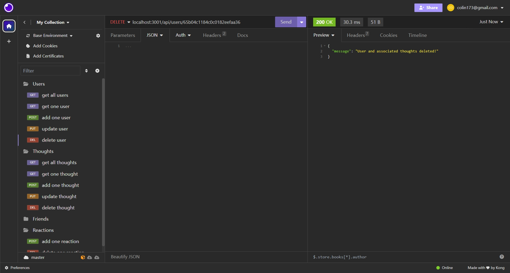
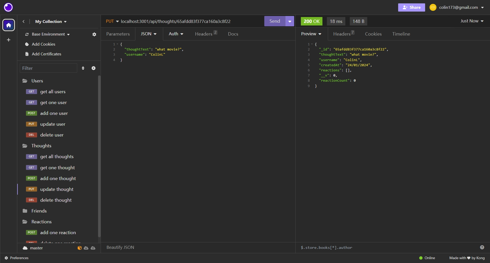

# social-network-API-nosql

## Description

a social network back end using MongoDB & Mongoose achieving different DB queries to get data from or update to the database

## Table of Contents

- [Installation](#installation)
- [Usage](#usage)
- [License](#license)
- [Contribution](#contribution)
- [Test](#test)
- [Further Questions](#furtherquestions)

## Installation

Open the directory from VS Code.

1. go to the db directory, use $npm run seed, to seed the database

2. run the server by using $npm run start

## Usage

1. Use insomnia to process user data, get all users, get one user, create, update & delete:

  
  
  
  
  

2. Use insomnia to process thought data, get all thoughts, get one thought, create, update & delete:

  
  
  
  
  

3. Use insomnia to process friend data, add & delete:

  
  

4. Use insomnia to process reaction data, add & delete:

  
  

6. here is the video walk through of the installation & query:
https://drive.google.com/file/d/1xuG6A52y3TOszDtA5qUjH6PSzfGwD1en/view

## License

N/A

## Contribution
You can contribute to this application by revising the codes here:  
https://github.com/mkdkck/socialNetworkAPI-NoSQL

## Test
N/A

## FurtherQuestions

please review the codes here：  
https://github.com/mkdkck/socialNetworkAPI-NoSQL

or contact the owner via: colin173@gmail.com

## Badges

